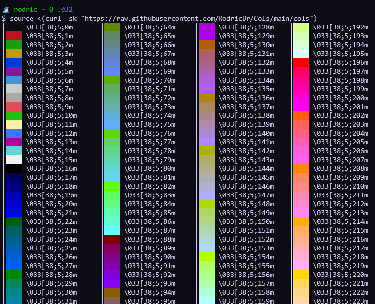

<h1 align="center">Cols</h2>

<h4 align="center"><strong>Simple & Practical xterm-256color Terminal Color Pallet</strong></h4>

<p align="center">
  
</p>

<hr>

## - Installation
> **Note**
>
> Works only for xterm-256color.
```console
$ wget -qq "https://raw.githubusercontent.com/RodricBr/Cols/main/cols" -O cols
$ chmod u+x cols
```

Or, just to test Cols:
```console
source <(curl -sk "https://raw.githubusercontent.com/RodricBr/Cols/main/cols")
```

<br>

## - Example
<p align="center">
  <kbd>
    
  </kbd>
</p>

<br>
